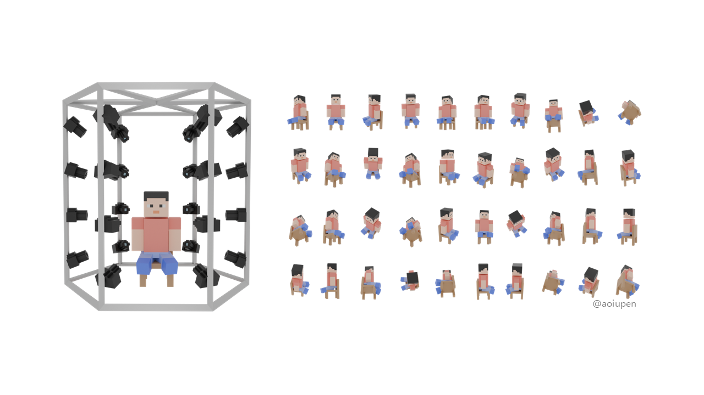
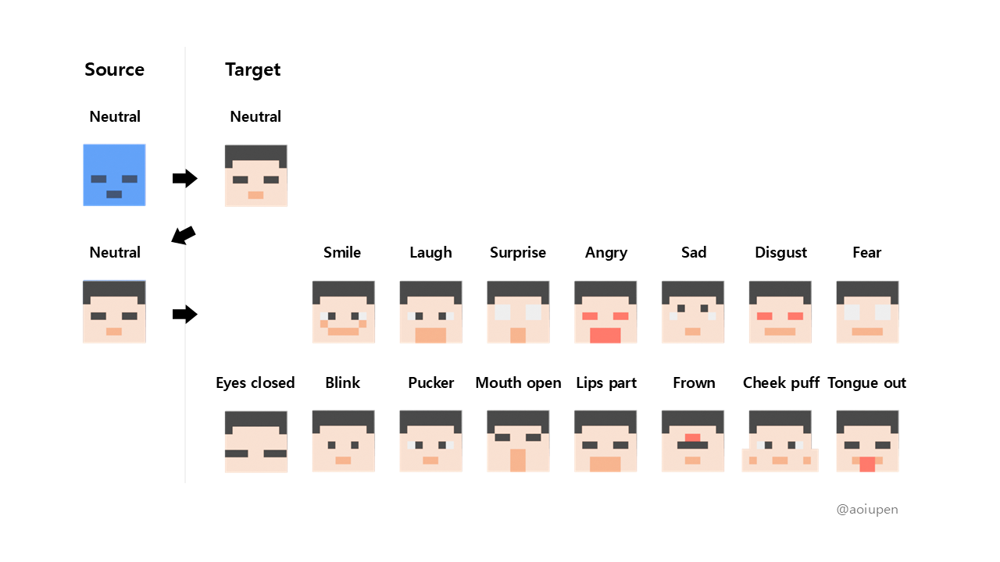
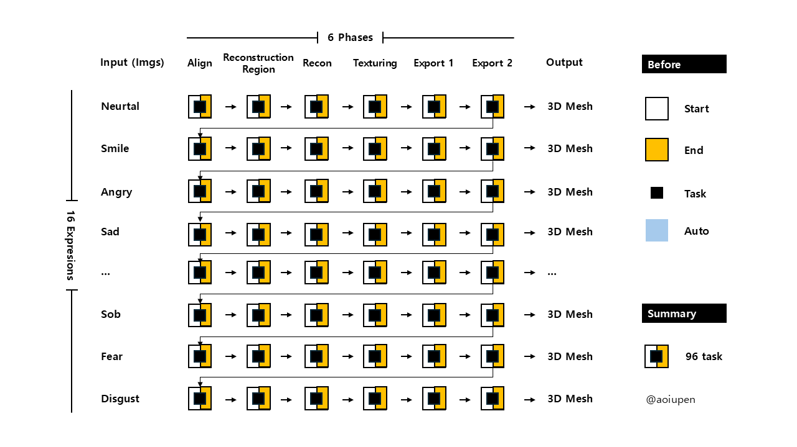
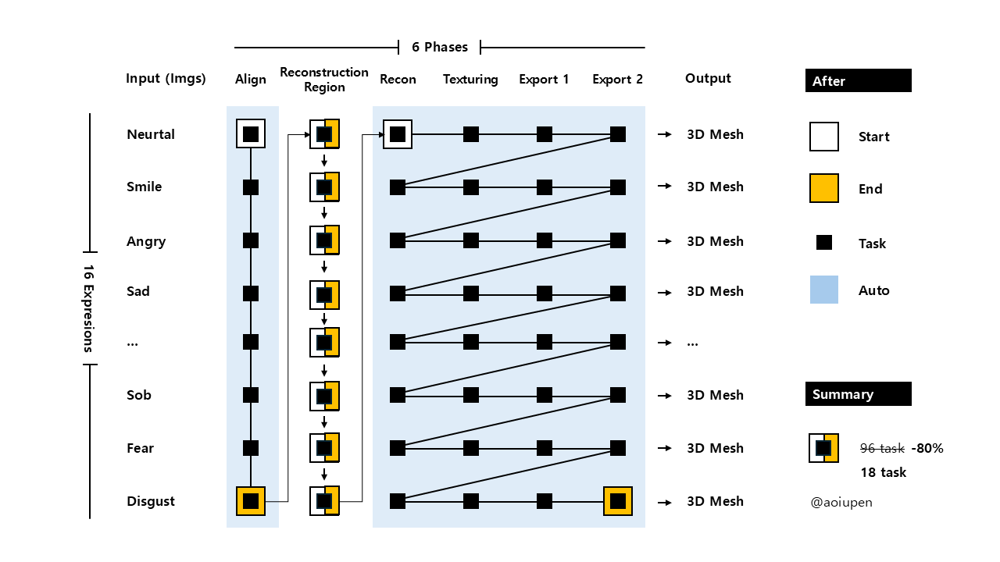
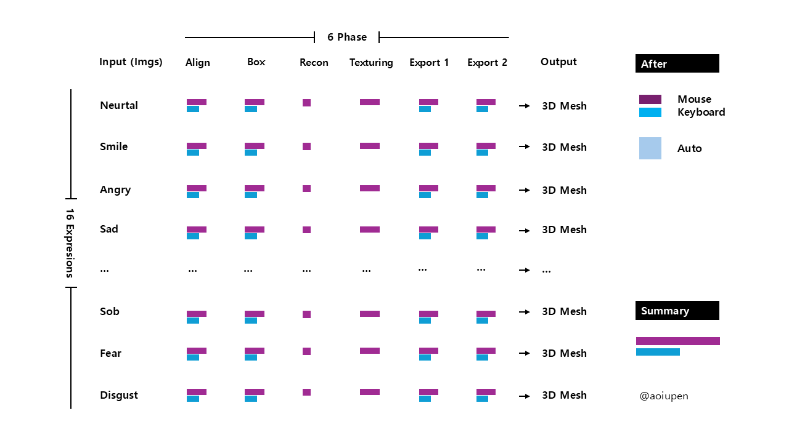
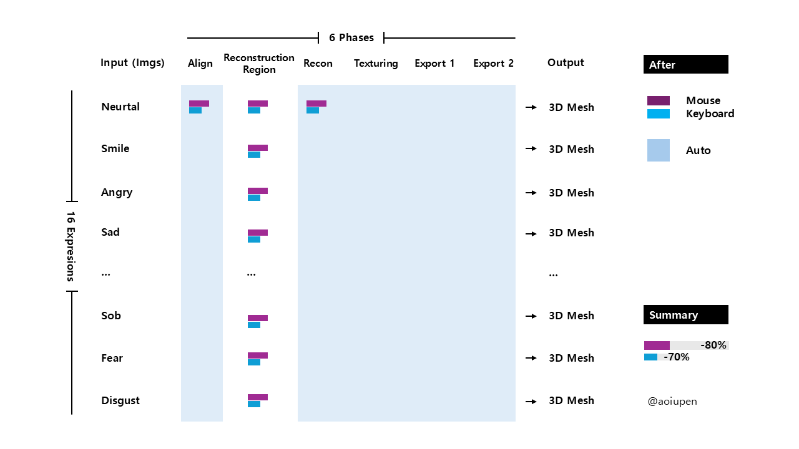
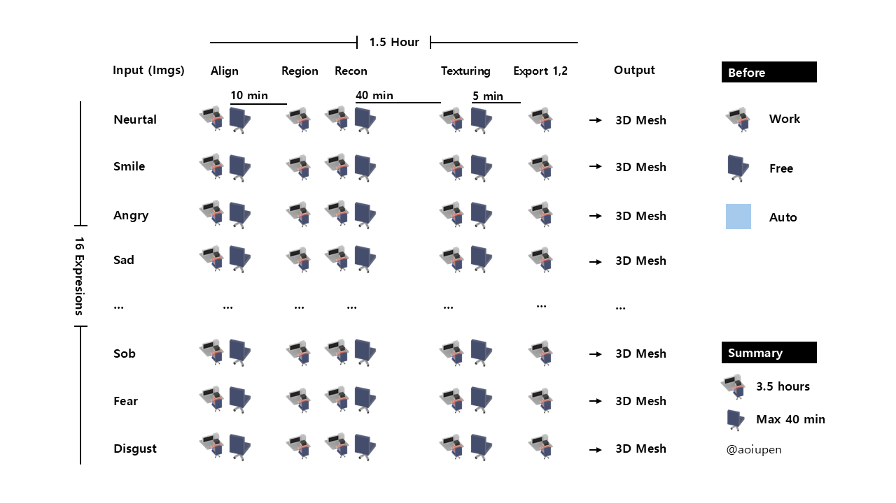
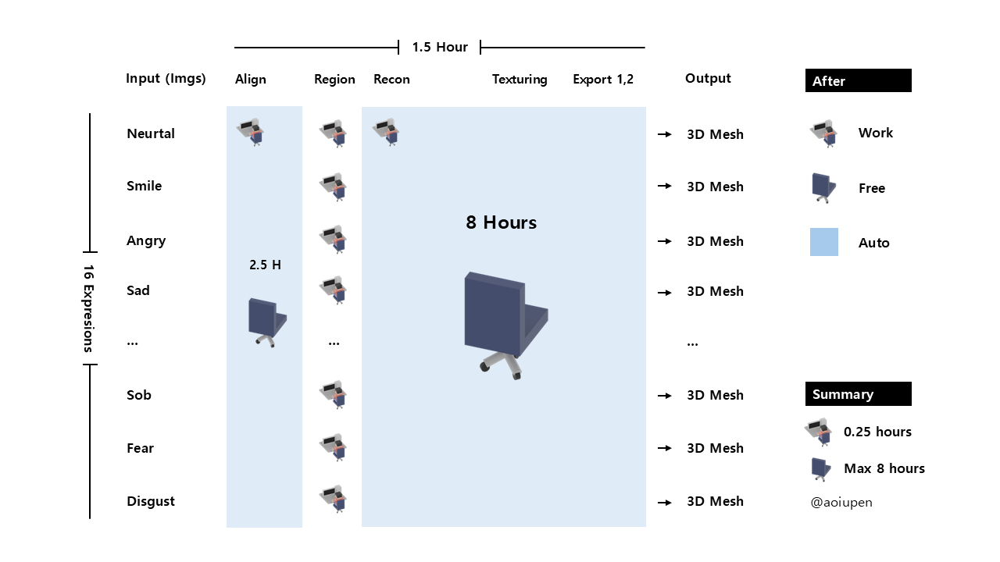

## Under Update
# experimental-3D-Face-Mesh-Automation
- Automating 3D facial mesh generation and improving work efficiency with PyQt-based UX

# Facescape 2020 Paper Reference

**Purpose**: Generate 3D facial models from a single face image  
**Process**:
- **3D Scanning**: 360-degree photo capture
- **3D Mesh Construction**: Multi-view images → 3D model → Normalized topology
- **Training and Rigging**: PCA model training → Blend shape-based rigging

# 3D Mesh Data Construction

- **Tools**: Reality Capture, Wrap 3D, Blender (+API)  
- **Language**: Python (PyQt framework)

## 1. Multi-view Images → 3D Model (Reality Capture)

## 2. 3D Model → Normalized Topology (Wrap 3D, Blender)

# Automation (Python, API Utilization)

- **Goal**: Automate and batch repetitive tasks in Reality Capture, Wrap 3D, and Blender
- **Effect**: Improved work speed and accuracy, enhanced team productivity, project duration reduced by 70%

## 1. Multi-view Images → 3D Model (Reality Capture)

### 1) Work Flow Perspective

### 2) Work Load Perspective

### 3) Idle Time Perspective

