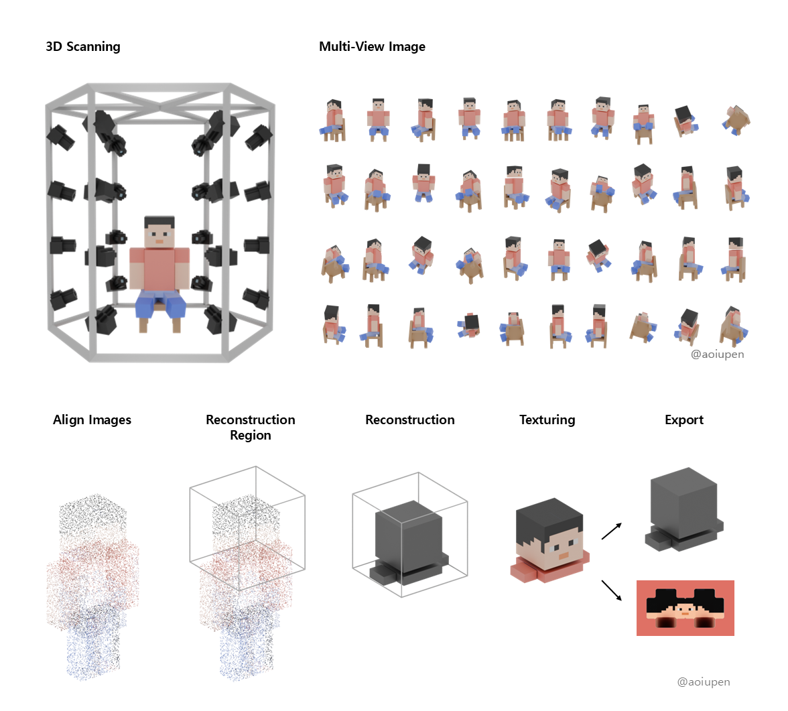
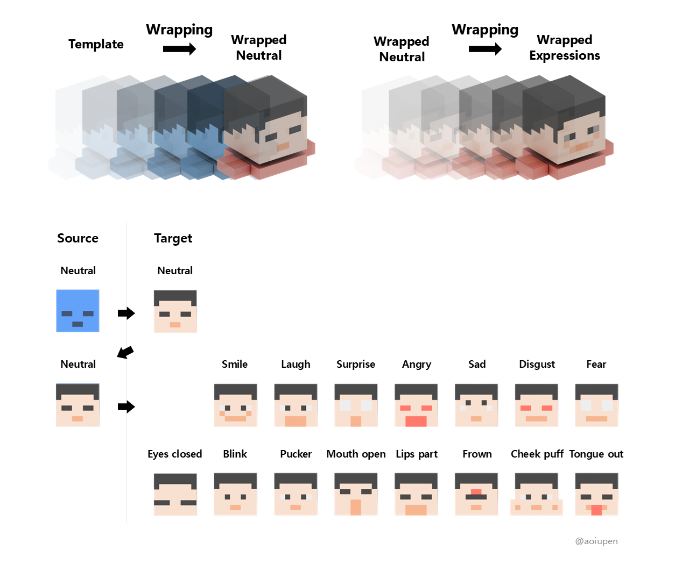
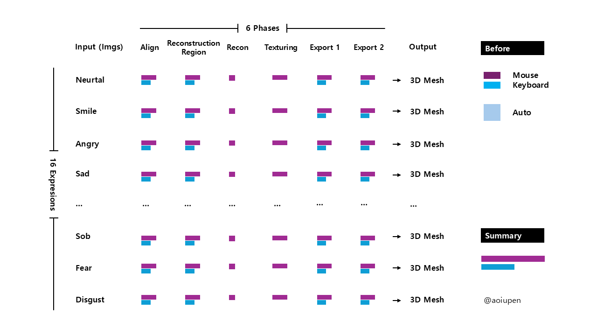

## 업데이트 중
# experimental-3D-Face-Mesh-Automation
- 3D 얼굴 메시 생성 자동화 및 PyQt 기반 UX로 작업 효율성 향상

# Facescape 2020 논문 참조

**목적** : 1장의 얼굴 이미지만으로 3D 얼굴 모델 생성  
**과정**
- **3D 스캐닝** : 360도 사진 촬영
- **3D 메쉬 구축** : 멀티뷰 이미지 → 3D 모델 → 정규화된 토폴로지
- **학습 및 리깅** : PCA 모델 학습 → 블렌드 쉐이프 기반 리깅

# 3D Mesh 데이터 구축

- **툴** : Reality Capture, Wrap 3D, Blender (+API)  
- **언어** : Python (PyQt 프레임워크)

## 1. 멀티뷰 이미지 → 3D 모델 (Reality Capture)

## 2. 3D 모델 → 정규화된 토폴로지 (Wrap 3D, Blender)

# 자동화 (Python, API 활용)

- **목표** : Reality Capture, Wrap 3D, Blender의 반복 작업 자동화, 배치화
- **효과** : 작업 속도 및 정확도 향상, 팀 생산성 향상, 프로젝트 기간 70% 단축

## 1. 멀티뷰 이미지 → 3D 모델 (Reality Capture)

### 1) Work flow 관점

### 2) Work load 관점

### 3) Idle time 관점

